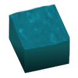

# Waterfill Retexture
[Mod Portal](https://mods.factorio.com/mod/waterfill-retexture)

Retextures waterfill to feel more vanilla.

This works with any mod that adds water-placing items.
Any technology named "waterfill" will also have its icon changed.

Note: Items that place non-vanilla water are not supported.
Post a comment on the mod portal if this is an issue, and I may add it.

